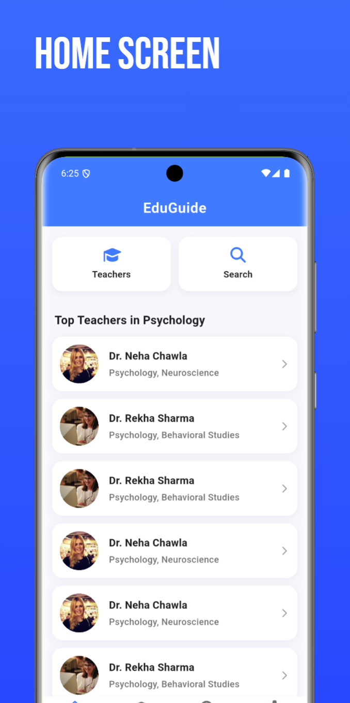
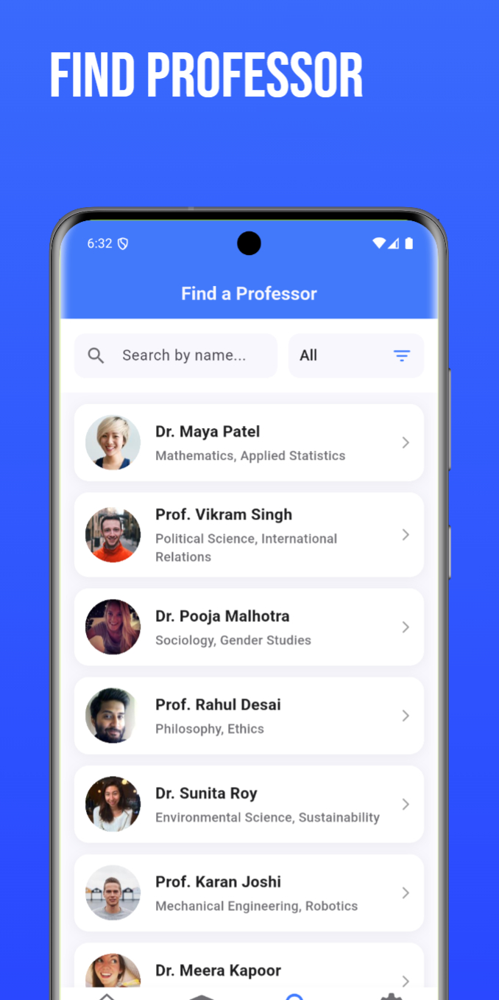

<div align="center">

# EduGuide


**Bridging the gap between students and faculty with modern technology.**

[](https://drive.usercontent.google.com/download?id=1Wr3IqYVE6PAhmIxaFmMak3I0B7jZ2vWi&export=download&authuser=0)
[](https://eduguide-app.vercel.app/)
[](https://github.com/sahilmishra03/eduguide-app)
[](https://flutter.dev)

</div>

## 📱 About EduGuide

EduGuide is a comprehensive academic guidance app designed specifically for college students. Built with a modern, intuitive interface, it helps students find the right faculty mentors, track real-time availability, and schedule appointments efficiently.

### 🚀 Current Version: 1.0.1

Trusted by 500+ students across campuses, EduGuide simplifies your academic journey with powerful features and an intelligent interface.

## ✨ Key Features

### 👨‍🏫 Teacher Profiles
- Comprehensive faculty profiles with qualifications and specializations
- Research interests and academic background
- Office location and contact information
- Professional photo and department details

### 📅 Real-Time Availability
- Live availability tracking with Firebase Firestore
- Weekly timetable view of office hours
- Auto-slot detection and conflict prevention
- Real-time status updates across all devices

### 🔍 Smart Search & Filters
- Advanced search by department, specialization, or availability
- Instant autocomplete and smart filtering
- Quick access to frequently contacted faculty
- Save favorite teachers for quick access

### 📧 One-Tap Communication
- Professional email templates for contacting teachers
- Direct appointment scheduling
- Calendar integration for reminders
- Meeting request tracking

### 🎨 Modern Interface
- Clean, distraction-free user experience
- Optimized for students and faculty
- Smooth animations and transitions
- Accessibility-focused design

## 🛠️ Tech Stack

- **Framework**: Flutter 3.19+
- **Language**: Dart
- **Backend**: Firebase Firestore
- **Authentication**: Firebase Auth
- **State Management**: Provider/BLoC
- **Real-time Sync**: Firebase Realtime Database
- **Email Service**: Firebase Cloud Functions

## 📸 App Screenshots

<div align="center">
  
  
  
  
</div>

<br>

<div align="center">
  <strong>Home</strong> • <strong>Search</strong> • <strong>Profile</strong> • <strong>Availability</strong>
</div>

## 🚀 Upcoming Features (v1.2.0)

- ⭐ **Professor Ratings** - Anonymous rating system for teaching quality
- 📅 **Smart Booking** - Direct appointment slot booking with approval
- 🤖 **AI Study Assistant** - Personalized study tips and recommendations
- 🌐 **Multi-Language** - Support for regional languages
- 📊 **Analytics Dashboard** - Insights on faculty interaction patterns

## 📥 Installation

### Android (Current)
1. Download the APK from the link below
2. Enable "Install from unknown sources" in your device settings
3. Install the APK and launch the app

[**Download Android App**](https://drive.usercontent.google.com/download?id=1Wr3IqYVE6PAhmIxaFmMak3I0B7jZ2vWi&export=download&authuser=0)

### iOS (Coming Soon)
- Currently in development
- Will be available on the App Store

## 🏗️ Development Setup

### Prerequisites
- Flutter SDK 3.19 or higher
- Dart SDK compatible with Flutter version
- Android Studio / VS Code with Flutter extensions
- Firebase project configuration

### Clone and Run
```bash
# Clone the repository
git clone https://github.com/sahilmishra03/eduguide-app.git
cd eduguide-app

# Install dependencies
flutter pub get

# Configure Firebase (follow firebase.json setup)
flutterfire configure

# Run the app
flutter run
```

### Build for Release
```bash
# Android APK
flutter build apk --release

# Android App Bundle
flutter build appbundle --release
```

## 📁 Project Structure

```
lib/
├── features/           # Feature-based architecture
│   ├── auth/          # Authentication screens & logic
│   ├── home/          # Home screen & dashboard
│   ├── search/        # Teacher search functionality
│   ├── profile/       # Teacher profile views
│   └── availability/  # Availability tracking
├── models/            # Data models (Teacher, Schedule, etc.)
├── providers/         # State management providers
├── services/          # API services and Firebase integration
├── utils/             # Utility functions and helpers
├── widgets/           # Reusable UI components
└── main.dart         # App entry point
```

## 🔒 Privacy & Security

- **Secure Authentication**: Firebase Auth with email/password
- **Data Encryption**: All sensitive data encrypted in transit
- **Minimal Data Collection**: Only essential information stored
- **GDPR Compliant**: Privacy-first approach to user data
- **Role-Based Access**: Different permissions for students vs faculty

## 👥 Contributors

<div align="center">

**Designed with ❤️ by**

[](https://www.linkedin.com/in/krishgupta7/)
[](https://www.linkedin.com/in/sahilmishra03/)

</div>

## 📞 Support & Contact

- **Email**: SAHILMISHRA03032005@gmail.com or KRISHGUPTA0072@gmail.com
- **Website**: [eduguide-app.vercel.app](https://eduguide-app.vercel.app/)
- **Issues**: [GitHub Issues](https://github.com/sahilmishra03/eduguide-app/issues)

## 🤝 Contributing

We welcome contributions! Please read our [Contributing Guidelines](CONTRIBUTING.md) before submitting pull requests.

### How to Contribute
1. Fork the repository
2. Create a feature branch (`git checkout -b feature/AmazingFeature`)
3. Commit your changes (`git commit -m 'Add some AmazingFeature'`)
4. Push to the branch (`git push origin feature/AmazingFeature`)
5. Open a Pull Request


---

<div align="center">

**⭐ Star this repository if it helped you!**

Made with ❤️ for the academic community

</div>
